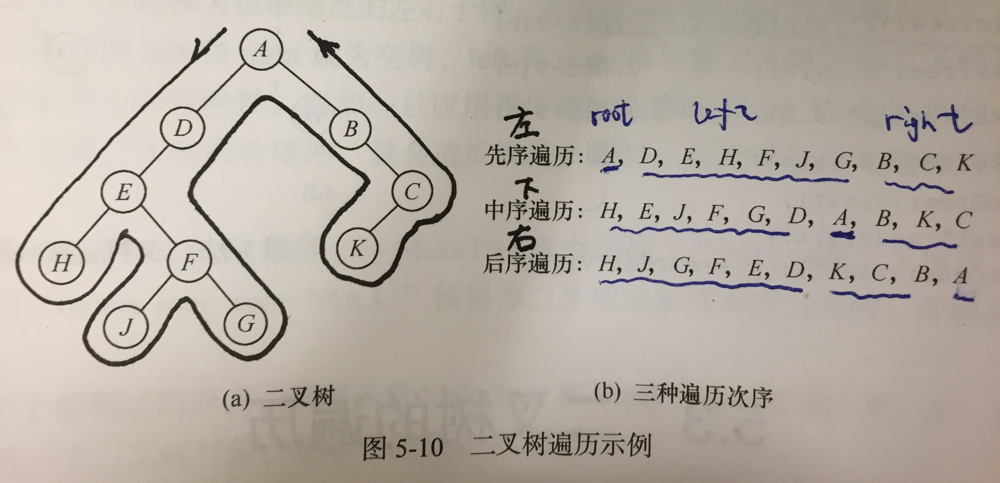

[Link](https://leetcode.com/problems/construct-binary-tree-from-preorder-and-inorder-traversal/)




```java
/**
 * Definition for a binary tree node.
 * public class TreeNode {
 *     int val;
 *     TreeNode left;
 *     TreeNode right;
 *     TreeNode(int x) { val = x; }
 * }
 */
public class Solution {
    public TreeNode buildTree(int[] preorder, int[] inorder) {
        if (preorder.length == 0 || inorder.length == 0) {
            return null;
        }
        return help(preorder, inorder, 0, preorder.length, 0, inorder.length);
    }
    private TreeNode help(int[] preorder, int[] inorder,
                          int ps, int pe, int is, int ie) { // tail exclusive
        if (ps >= pe || is >= ie || ps < 0 || pe > preorder.length || is < 0 || ie > inorder.length) {
            return null;
        }
        TreeNode root = new TreeNode(preorder[ps]);
        int mid = 0;
        for (int i = is; i < ie; i++) {
            if (inorder[i] == root.val) {
                mid = i;
            }
        }
        int L = mid - is;
        int R = ie - is - L - 1;
        root.left = help(preorder, inorder, ps + 1, ps + L + 1, is, is + L);
        root.right = help(preorder, inorder, ps + L + 1, pe, is + L + 1, ie);
        return root;
    }
}
```
