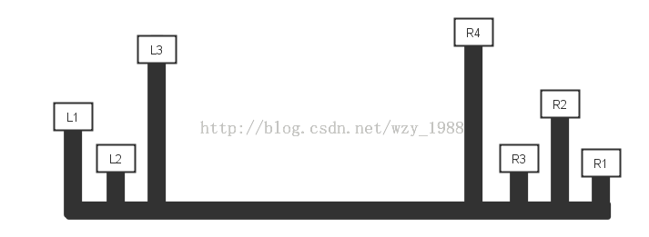

[Link](https://leetcode.com/problems/container-with-most-water/)



* 假定初始的盛水面积为ans=0，lh为左边的高度，rh为右边的高度，如果lh < rh, 则向右运动，寻找第一个比当前lh大的左节点。同理，如果lh > rh，则向左运动，寻找第一个比当前rh大的右节点。

```java
public class Solution {
    public int maxArea(int[] height) {
        
        int lpos = 0;
        int rpos = height.length - 1;
        int max = 0;
        
        while (lpos < rpos) {
            int area =  Math.min(height[lpos], height[rpos]) * (rpos - lpos);
            max = Math.max(max, area);
            if (height[lpos] < height[rpos]) {
                lpos++;
            } else {
                rpos--;
            }
        }
        
        return max;
    }
}
```
