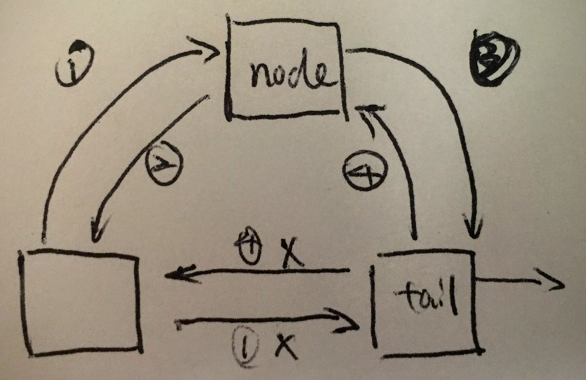

[Link](https://leetcode.com/problems/lru-cache/)

* 三个主要私有方法：
  1. removeFirst
  2. removeNode
  3. addToTail
* 分开`removeNode`和`addToTail`
* `removeFirst`依赖于`removeNode`的实现
* dummynode: head, tail
* 同时管理 map 和 双向链表


```java
public class LRUCache {
    private class Dlink {
        Dlink prev;
        Dlink next;
        int key;
        int val;
        Dlink(int key, int val) {
            this.key = key;
            this.val = val;
            prev = null;
            next = null;
        }
    }
    
    int capacity;
    HashMap<Integer, Dlink> map;
    Dlink head;
    Dlink tail;
    
    private void removeFirst() {
        removeNode(head.next);
    }
    
    private void removeNode(Dlink node) {
        node.prev.next = node.next;
        node.next.prev = node.prev;
    }
    
    private void addToTail(Dlink node) {
        tail.prev.next = node;
        
        node.prev = tail.prev;
        node.next = tail;
        
        tail.prev = node;
    }
    
    
    public LRUCache(int capacity) {
        this.capacity = capacity;
        map = new HashMap<Integer, Dlink>();
        head = new Dlink(-1, -1);
        tail = new Dlink(-1, -1);
        head.next = tail;
        tail.prev = head;
    }
    
    public int get(int key) {
        Dlink node = map.get(key);
        if (node == null) {
            return -1;
        }
        
        removeNode(node);
        addToTail(node);
        
        return node.val;
    }
    
    public void set(int key, int value) {
        Dlink node = map.get(key);
        if (node == null) {
            node = new Dlink(key, value);
            map.put(key, node);
        } else {
            node.val = value;
            removeNode(node);
        }
        
        addToTail(node);
        
        if (map.size() > capacity) {
            map.remove(head.next.key);
            removeFirst();
        }
    }
}
```
