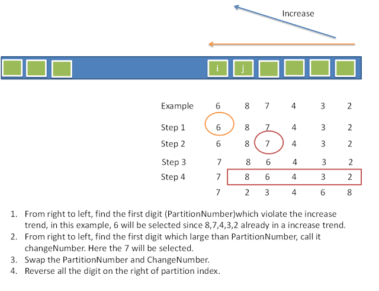

[Link](https://leetcode.com/problems/next-permutation/)

1. find dropNumber, (right to left, first decreasing number)
2. find changeNumber, (right to left, first number larger than dropNumber)
3. swap dropNumber changeNumber
4. sort region after origin dropNumber postion



```java
public class Solution {
    public void nextPermutation(int[] nums) {
        
        int dropIndex = -1;
        for (int i = nums.length - 2; i >= 0; i--) {
            if (nums[i] < nums[i + 1]) {
                dropIndex = i;
                break;
            }
        }
        if (dropIndex == -1) {
            Arrays.sort(nums);
            return;
        } 
        
        int changeIndex = -1;
        for (int i = nums.length - 1; i >= 0; i--) {
            if (nums[i] > nums[dropIndex]) {
                changeIndex = i;
                break;
            }
        }
        
        swap(nums, dropIndex, changeIndex);
        Arrays.sort(nums, dropIndex + 1, nums.length);
    }
    
    private void swap(int[] nums, int x, int y) {
        int temp = nums[x];
        nums[x] = nums[y];
        nums[y] = temp;
    }
}
```
