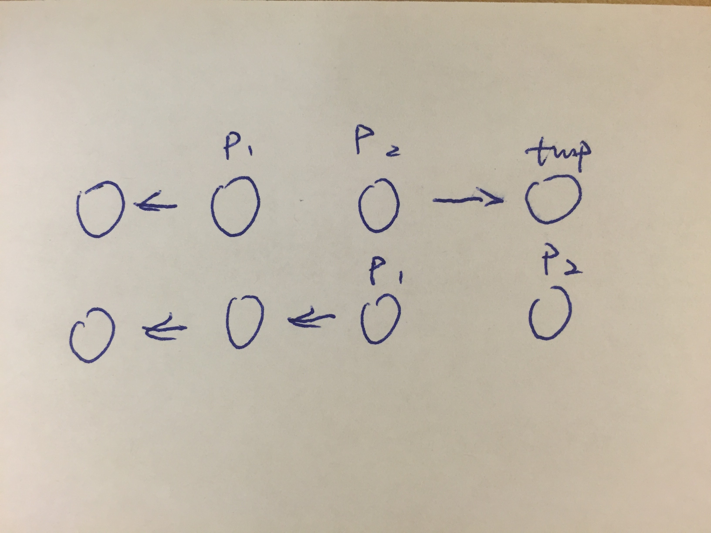

[Link](https://leetcode.com/problems/reverse-linked-list/)



```java
/**
 * Definition for singly-linked list.
 * public class ListNode {
 *     int val;
 *     ListNode next;
 *     ListNode(int x) { val = x; }
 * }
 */
public class Solution {
    public ListNode reverseList(ListNode head) {
        if (head == null || head.next == null) {
            return head;
        }   

        ListNode p1 = head; // 起始翻转点
        ListNode p2 = head.next;
        ListNode save = p1;

        while (p2 != null) { //终止条件
            ListNode tmp = p2.next;
            p2.next = p1;
            p1 = p2;
            p2 = tmp;
        }
        save.next = p2;
        head = p1; // p1 是翻转后的起始点
        
        
        return head;
    }
}
```
