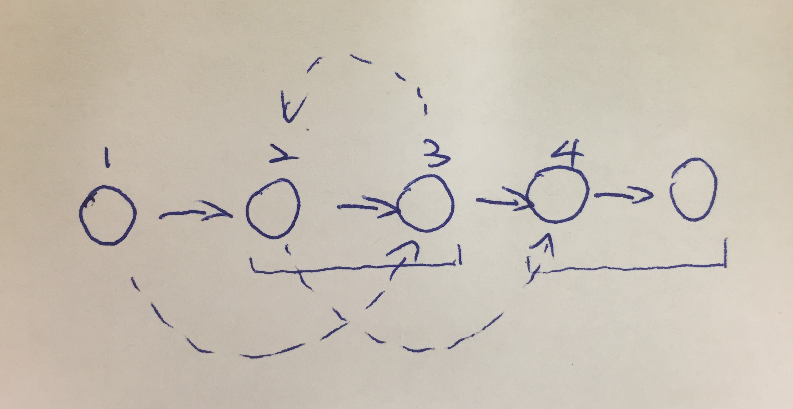

[Link](https://leetcode.com/problems/swap-nodes-in-pairs/)



```java
/**
 * Definition for singly-linked list.
 * public class ListNode {
 *     int val;
 *     ListNode next;
 *     ListNode(int x) { val = x; }
 * }
 */
public class Solution {
    public ListNode swapPairs(ListNode head) {
        if (head == null || head.next == null) {
            return head;
        }   
        ListNode dummy = new ListNode(-1);
        dummy.next = head;
        ListNode move = dummy;
        while (move != null && move.next != null && move.next.next != null) {
            ListNode p1 = move;
            ListNode p2 = move.next;
            ListNode p3 = move.next.next;
            ListNode p4 = move.next.next.next;
            p1.next = p3;
            p3.next = p2;
            p2.next = p4;
            move = p2; // 已经交换过了
        }
        return dummy.next;
    }
}
```
