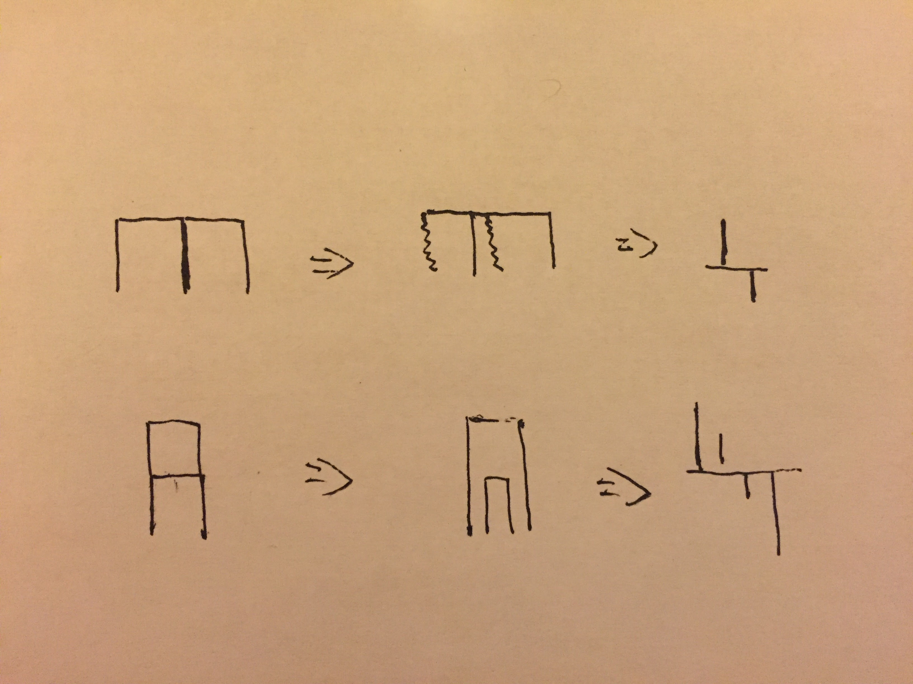

[Link](https://leetcode.com/problems/the-skyline-problem/)



* 注意sort，将close edge设为负数

```java
public class Solution {
    private class Edge {
        int start;
        int x;
        int h;
        public Edge(int start, int x, int h) {
            this.start = start;
            this.x = x;
            this.h = h;
        }
    }
    private class EdgeComparator implements Comparator<Edge> {
        public int compare(Edge e1, Edge e2) {
            if (e1.x != e2.x) {
                return e1.x - e2.x;
            } else {
                return e2.h * e2.start - e1.h * e1.start;
            }
        }
    }
    private class HeapComparator implements Comparator<Integer> {
        public int compare(Integer i1, Integer i2) {
            return i2 - i1;
        }
    }
    public List<int[]> getSkyline(int[][] buildings) {
        List<int[]> res = new ArrayList<int[]>();
        if (buildings == null || buildings.length == 0) {
            return res;
        }
        
        ArrayList<Edge> edges = new ArrayList<Edge>();
        for (int i = 0; i < buildings.length; i++) {
            int[] building = buildings[i];
            edges.add(new Edge(1, building[0], building[2]));
            edges.add(new Edge(-1, building[1], building[2]));
        }
        Collections.sort(edges, new EdgeComparator());
        PriorityQueue<Integer> heap = 
                new PriorityQueue<Integer>(buildings.length, new HeapComparator());
        int H = 0;
        int curH = 0;
        for (int i = 0; i < edges.size(); i++) {
            Edge e = edges.get(i);
            if (e.start > 0) {
                heap.offer(e.h);
                curH = heap.peek();
            } else {
                heap.remove(Integer.valueOf(e.h));
                curH = heap.isEmpty() ? 0 : heap.peek();
            }
            if (curH != H) {
                H = curH;
                res.add(new int[]{e.x, H});
            }
            
        }
        return res;
    }
}
```
